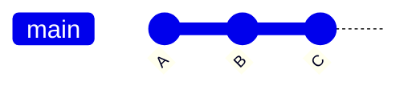
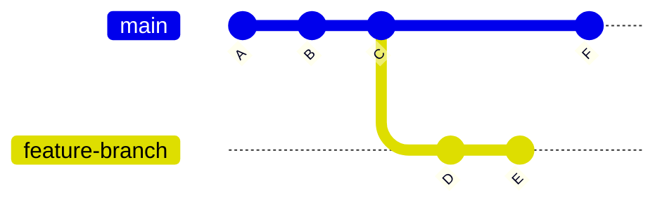
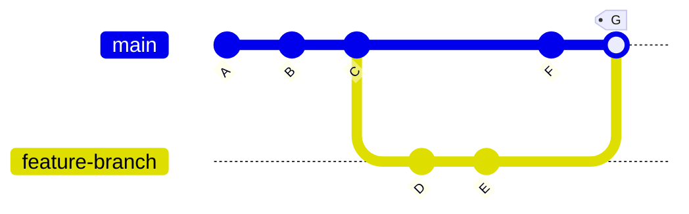
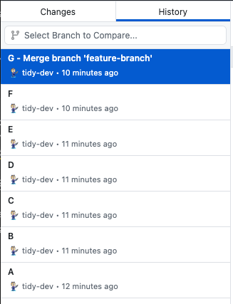
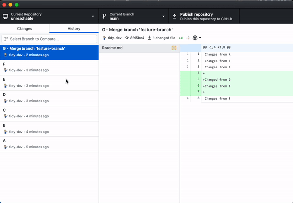

# Reachable and Unreachable Commits

In Git, every commit will have at least one parent commit except the very first. Additionally, a repository may have any number of branches that begin at any particular commit. Because of this we can create a graph of the history of a commit by following the path from one commit's parent to the another. Given a branch `main`, whose initial commit is `A`, and we add commit `B` and `C`, the resulting graph would be as follows:

Since we can follow the graph from `C` to `A`, that means that `A` is **reachable** by or from `C`. This as known as following the ancestral path of `C`.

## Unreachable Commits
Now, if we create a new branch called `feature-branch` from `C` and commit `D` and `E` and then return to `main` and commit `F`. We would have the resulting graph:

In the above example, `B` is reachable by `F` through the ancestral path of `F`-> `C` -> `B`,  and `B` is reachable by `E` through `E` -> `D` -> `C` -> `B`. However, there is no such path to get to `E` or `D` from `F`. Thus, `E` and `D` are **unreachable** from `F`.

## Git Commands Use the Ancestral Path
Some Git commands use the ancestral path to determine what to show. One of those is `git diff`, which is used to see the changes between two commits non inclusive of the first commit. If we execute `git diff A..C`, we will receive the set of changes from the commits along the ancestral path from `C` to `A` or `C` -> `B` -> `A`. Thus, we would see changes from `B` and `C`. Likewise, if we executed `git diff B..F`, we will get changes from reachable from `F`; thus, `F` -> `C` -> `B`. But, not changes from `E` and `D` as they are unreachable.

## Merge Commits
Now, let's say that we merge the `feature-branch` into our `main` branch. Our graph becomes:

Still `E` and `D` are unreachable by `F`. But, you may think "I merged the `feature-branch` into `main`, so I should be able to see changes from `E` and `D`." This is true if you start at a commit that has them in its ancestral path. That is `G` and it is known as a **merge commit**, and it is special in that it has two parents. The first is `F` as the last commit of the branch being merged into, and `E` as the last commit of the branch being merged. Now, all the commits in this graph are ancestors of `G`. Thus, if we were to execute `git diff B..G`. We will see changes of all ancestral paths of `G` to `B`. Those paths are `G` -> `F` -> `C` -> `B` and `G`-> `E` -> `D` -> `C` -> `B`. Therefore we will see changes from `G`, `F`, `E`, `D`, and `C`.

# GitHub Desktop
In GitHub Desktop, commits are displayed linearly and in chronological order. Thus, the graph from the previous section `Merge Commits` would look like:

In GitHub Desktop, diffing across multiple commits is accomplished through a range selection that results in executing `git diff`, which shows the changes of comparing the first and last commit in the selection (inclusive). Therefore, generating a diff on a branch where merge commits exist may result in unreachable commits being inside a diff selection. The following shows the unreachable commit scenario described above in `Merge Commits`.

